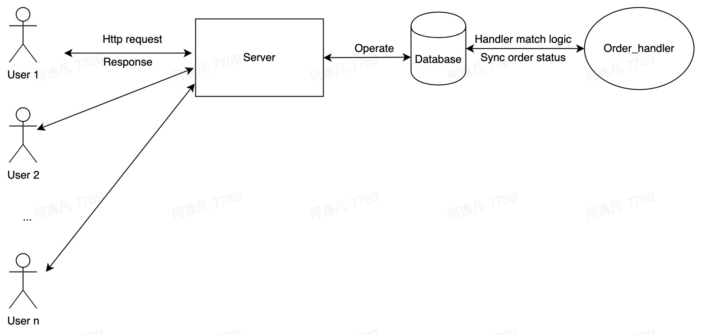

# Trade Engine

## Trade Engine structure

## Introduction
I mainly use the django framework to develop web applications. 
There are generally three types of ideas to deal with this kind of problem. 
The first type is asynchronous requests, using celery+django. The second type is to use message middleware, 
using Kafka or rocketMQ. 
The third category is to use the method of synchronous request. 

Here I chose to use the regular request method to deal with this kind of problem. 
If we use the regular synchronous request method, it is difficult to deal with high concurrency scenarios. 
Therefore, I chose to use the method of launching an extra process to handle the order matching logic exclusively.

The user only needs to send a http request to the background, 
and the background will create a data with status according to the request. 
At this time, a special process will handle the logic of the order. 
All orders created by the user will be in the enqueued state, indicating that they are being queued. 

The handler first ensures the survivability of the handler process, 
and checks the process status every time in a while. 
The process will select the enqueued buy orders, 
add them to the queue, and sort them in the order of timestamp. 
After that, look for the sell order corresponding to each order, of course, also sorted by timestamp. 
If there is a match, the corresponding logic processing will be performed to change the state, 
if not, it will be skipped. The process pulls metadata information for logical processing every once in a while.

Every time user make a trade, the create http request will be sent to the server, and the server will write the metadata
into the database. Apart from that, the process will handle the metabase to deal with the matching process.
After that, if the status is changed, it will be a response, but if there is long time not been matched or user killed 
it by themselves, the trade will be set to killed automatically.

## Use the system
Firstly, the requirement packages need to be installed. Then, make sure the database is created correctly.
The last step is run startEngine.sh to start the server!

http://127.0.0.1:8000/trade/orders/make is the main url to make a new trade
Method: Post
Example Request.body:
    {
        "type":"buy",
        "price":9000,
        "quantity":5
    }
